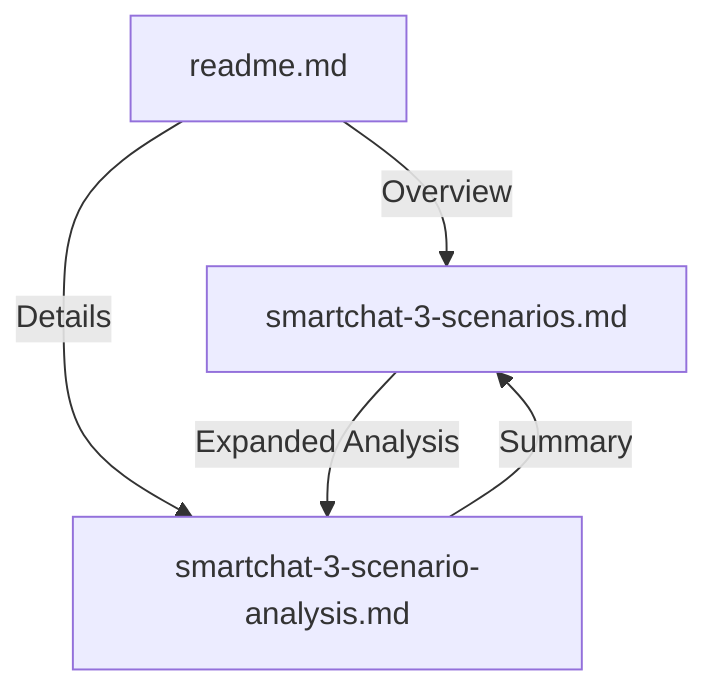

# Sentient Cloud SmartChat - Complete Pricing Analysis Package

# Sentient Cloud SmartChat - Complete Pricing Analysis Package

## Overview

This comprehensive package contains detailed pricing and resource analysis for implementing Sentient Cloud SmartChat across three different deployment scenarios. All documents are designed for both AI and human readers to quickly understand costs, resource requirements, and deployment options.

## 🎯 Quick Start Guide

### For Quick Decision (5-10 minutes)
1. Complete the **Sales Questionnaire** (questions.md) to determine the most suitable cost scenario
2. Check the **Three Scenarios at a Glance** table below
3. Read the **Scenario Profiles** section
4. Use the **Decision Tree** to identify the best option for your needs

### For Detailed Analysis (30-45 minutes)
1. Review the **Component Analysis** section
2. Study the **Cost Breakdowns**
3. Check **Team Composition** requirements
4. Review **Implementation Timelines**

### For Executive Briefing (20-30 minutes)
1. Focus on **Key Findings and Recommendations**
2. Use the **Comparison Tables** for quick reference
3. Review **Scenario Pros and Cons**

---

## 📋 Document Structure

### Core Documents

This section provides a clear understanding of each file in this package and how they relate to each other:

1. **smartchat-3-scenario-analysis.md** 
   - **Primary Document**: Comprehensive analysis comparing three deployment scenarios for Sentient Cloud SmartChat
   - **Purpose**: Detailed technical and financial comparison between Sentient Cloud, Private Cloud, and On-Premise deployments
   - **Key Content**: 
     - Executive summary of all scenarios
     - Detailed component analysis (20+ components)
     - Cost breakdowns and comparisons
     - Resource requirements and team compositions
     - Implementation timelines and complexity assessment

2. **smartchat-3-scenarios.md**
   - **Executive Summary**: Concise overview of the three deployment scenarios
   - **Purpose**: Quick reference guide for decision-makers needing high-level comparisons
   - **Key Content**:
     - At-a-glance comparison tables
     - Scenario profiles with pros/cons
     - Decision framework and recommendations
     - Cost and effort summaries

3. **document-guide.md**
   - **Navigation Guide**: Explains how to navigate the document package
   - **Purpose**: Helps users understand the document structure and where to find specific information
   - **Key Content**:
     - Document relationships and reading order
     - Quick reference tables
     - Guide to technical and financial sections

4. **delivery-summary.md**
   - **Delivery Overview**: Summary of key deliverables and findings
   - **Purpose**: Provides a structured overview of the analysis outcomes
   - **Key Content**:
     - Main findings and recommendations
     - Key differences between deployment options
     - Implementation considerations

5. **decision-matrix.md**
   - **Decision Framework**: Structured approach to evaluating deployment options
   - **Purpose**: Helps stakeholders systematically compare the three scenarios
   - **Key Content**:
     - Evaluation criteria and weighting
     - Scenario scoring
     - Decision-making framework

## 🧭 Navigation Guide

### Reading Paths by Role

**For Decision Makers & Executives:**
1. Start with the **Three Scenarios at a Glance** table
2. Review **Key Findings and Recommendations**
3. Check the **Decision Tree** for your specific needs

**For Technical Teams:**
1. Review **Component Analysis** sections
2. Check **Technical Requirements**
3. Review **Implementation Details**

**For Finance Teams:**
1. Review **Cost Breakdowns**
2. Check **Total Cost of Ownership**
3. Review **Hidden Costs** sections

### Document Relationships



## 📅 Document Information

- **Version:** 1.0 (October 2024)
- **Last Updated:** October 2024
- **All pricing in:** USD
- **Source Data:** CSV files in `/cost-scenarios/` directory
- **Audience:** Decision makers, technical teams, finance teams

## 🔄 How They Work Together

This package is designed as an integrated system where each document serves a specific purpose while complementing the others:

1. **Entry Point**
   - Start with `readme.md` for an overview
   - Use this document for navigation help

2. **Core Analysis Flow**
   - `smartchat-3-scenarios.md` provides a quick executive summary
   - `smartchat-3-scenario-analysis.md` offers the detailed technical analysis
   - `smartchat-3-scenarios.md` provides key findings and recommendations

3. **Decision Support**
   - `decision-matrix.md` helps with objective comparison of options
   - Cross-reference between documents using the consistent numbering system

4. **Document Relationships**
   - The executive summary (`smartchat-3-scenarios.md`) links to detailed sections in the main analysis
   - The main analysis (`smartchat-3-scenario-analysis.md`) provides in-depth data that supports the summaries
   - The decision framework in the main analysis document helps evaluate options

### 1. **smartchat-3-scenario-analysis.md** ⭐ MAIN DOCUMENT
**The most comprehensive analysis** - 34 KB, detailed breakdown

**Contains:**
- Executive summary comparing all three scenarios
- Detailed explanation of all 20 components
- Component analysis with scenario-specific differences
- Comprehensive comparative analysis with tables
- Full deployment scenario profiles
- Team composition and resource requirements
- Implementation timelines and complexity assessment
- Decision framework and recommendations
- Cost breakdowns for each scenario
- Hidden costs analysis

**Best for:** In-depth decision-making, technical evaluation, project planning
**Reading time:** 45-60 minutes for complete review
**Audience:** Project managers, technical leads, finance teams, decision makers

---

### 2. **smartchat-3-scenarios.md** ⭐ QUICK REFERENCE
**Executive summary and quick decision guide** - 12 KB, concise format

**Contains:**
- Quick comparison table of all three options
- Cost breakdown comparison
- Man-days and effort comparison
- Scenario profiles with pros/cons
- Decision tree for choosing your option
- Real-world scenario examples
- Comparison matrix at a glance
- Final recommendation framework
- Quick contact decision summary

**Best for:** Executive briefings, quick decision-making, stakeholder presentations
**Reading time:** 10-15 minutes
**Audience:** Executives, business leaders, stakeholders

---

### 3. **DOCUMENT_GUIDE.txt**
**Navigation and reference guide** - 7 KB

**Contains:**
- File descriptions
- Reading recommendations by use case
- Key findings summary
- Decision criteria guide
- Component breakdown
- Next steps

**Best for:** First document to read to understand the package structure
**Reading time:** 5 minutes
**Audience:** All readers

---

## 🎯 The Three Deployment Scenarios

### **Sentient Cloud** ($95,664 | 76 man-days)
**Premium Managed Deployment**
- Managed on Sentient infrastructure
- Includes $80K external AI customization service
- Fastest deployment (15-16 weeks)
- Lowest operational complexity
- Best for: Speed and managed services priority

### **Client Private Cloud** ($18,388 | 91 man-days)
**Cost-Optimized Deployment** ✨ CHEAPEST
- Deployment on client's private cloud
- 80.8% cheaper than Sentient Cloud
- Moderate complexity
- Implementation: 18-20 weeks
- Best for: Cost-conscious with infrastructure capability

### **On-Premise** ($23,623 | 119 man-days)
**Full Self-Managed Deployment**
- Deployment on client's on-premise servers
- 75.3% cheaper than Sentient Cloud
- Highest complexity
- Implementation: 24-27 weeks
- Best for: Data sovereignty and complete control

---

## 💰 Key Financial Facts

| Metric | Value |
|--------|-------|
| **Cheapest Option** | Client Private Cloud: $18,388 |
| **Most Expensive Option** | Sentient Cloud: $95,664 |
| **Cost Savings (CPC vs SC)** | 80.8% cheaper |
| **Cost Savings (OP vs SC)** | 75.3% cheaper |
| **The $80K Question** | Customisation service only in Sentient Cloud |
| **Total Man-Days Range** | 76 - 119 days |
| **Fastest Timeline** | Sentient Cloud (15-16 weeks) |
| **Longest Timeline** | On-Premise (24-27 weeks) |

---

## 🚀 Quick Start: Which Document Should I Read?

### For a Quick Decision (5-10 minutes)
Read: **smartchat-3-scenarios.md**
1. Start with "Quick Reference Guide" section
2. Read "Decision Tree"
3. Review your chosen scenario profile
4. Done!

### For Financial Planning (15-20 minutes)
Read: Both summary documents
1. Check cost breakdowns in both documents
2. Review "Hidden Costs Not Included"
3. Use decision criteria checklist

### For Technical Evaluation (45+ minutes)
Read: **smartchat-3-scenario-analysis.md** (main document)
1. Review "Executive Summary"
2. Read infrastructure components (sections 9-15)
3. Study "Team Composition and Resource Requirements"
4. Review your chosen scenario in full

### For Executive Briefing (20-30 minutes)
Prepare using: **smartchat-3-scenarios.md**
1. Create slides from comparison tables
2. Use scenario profiles for talking points
3. Reference real-world scenario examples

---

## 📊 The Three Scenarios at a Glance
```
┌─────────────────┬──────────────┬─────────────────┬───────────────┐
│ Factor          │ Sentient     │ Private Cloud   │ On-Premise    │
├─────────────────┼──────────────┼─────────────────┼───────────────┤
│ COST            │ $95,664      │ $18,388 ⭐      │ $23,623       │
│ EFFORT          │ 76 days ⭐   │ 91 days         │ 119 days      │
│ TIMELINE        │ 15-16 wks ⭐ │ 18-20 weeks     │ 24-27 weeks   │
│ COMPLEXITY      │ Low ⭐       │ Moderate        │ High          │
│ EXPERTISE NEEDS │ Minimal ⭐   │ Moderate        │ Expert        │
│ CONTROL         │ Low          │ Moderate        │ High ⭐       │
│ AI SERVICE      │ $80K ⭐      │ None            │ None          │
│ BEST FOR        │ Speed        │ Cost ⭐         │ Sovereignty   │
└─────────────────┴──────────────┴─────────────────┴───────────────┘
```

---

## 🔑 The Customisation Cost

One of the key cost factors is the **Customisation component**:
- **Included in Sentient Cloud deployment**
- Represents a significant portion of the total cost
- Covers document processing and embedding generation for AI-powered search
- Decision: Do you need premium AI customization?

**If NO:** Client Private Cloud is 80.8% cheaper
**If YES:** Sentient Cloud value proposition is much stronger

---

## 📖 Component Coverage

### Components Identical Across All Scenarios (10):
- Search and Retrieval
- System Administration Functions
- Reporting
- Workflows
- File Management
- SmartChat Frontend
- Analytics Dashboard
- Application Layer
- All Professional Services (Requirements, Design, Development, Testing, Training)

### Components That Differ (10):
- Customisation (biggest differentiator: $80K in SC only)
- Vector Database (0 in SC/CPC, 8 days in OP)
- API Gateway (0 in SC, 3 days in CPC, 6 days in OP)
- Database (2 days in SC, 6 in CPC, 10 in OP)
- Kubernetes Cluster (4 days in SC, 8 in CPC, 12 in OP)
- Large Language Model (4 days in SC, 6 in CPC, 12 in OP)
- AI Platform Database (6 days in SC, 8 in CPC, 11 in OP)

---

## 🎯 How to Use This Package

### Step 1: Understand Your Constraints
- Budget available?
- Team expertise level?
- Data sovereignty requirements?
- Timeline constraints?
- Control needs?

### Step 2: Read Appropriate Document
- Quick decision? → smartchat-3-scenarios.md
- Detailed analysis? → smartchat-3-scenario-analysis.md
- Navigation help? → This document (readme.md)

### Step 3: Use Decision Framework
Both documents contain decision trees and frameworks to help you choose.

### Step 4: Validate with Stakeholders
- Share relevant document with finance team
- Share technical requirements with infrastructure team
- Discuss data sovereignty with compliance/security

### Step 5: Contact Sentient
Ask specific questions about your chosen scenario and any custom requirements.

---

## ⚠️ Important: Hidden Costs

These documents contain **development and implementation costs ONLY**.

Your actual costs will likely include:
- **Sentient Cloud:** Service subscriptions, ongoing support contracts
- **Client Private Cloud:** Cloud infrastructure (compute, storage, networking), operations team
- **On-Premise:** Servers, networking, data center space, power/cooling, backup systems, admin team

On-Premise typically has the highest hidden infrastructure costs (often 2-3x development costs annually).

---

## 📞 Questions?

### For Questions About:
- **Sentient Cloud option** → Contact Sentient Sales
- **Technical details** → Contact Sentient Implementation Team
- **Pricing specifics** → Contact Sentient Finance/Account Management
- **Custom requirements** → Contact Sentient Account Manager

---

## 📈 Document Structure

**Sentient_Cloud_Three_Scenario_Analysis.md** (main document) includes:

1. Executive Summary
2. Document Overview
3. The 20 Components (detailed, with scenario comparisons)
4. Comparative Analysis (financial and resource)
5. Deployment Scenarios (detailed profiles)
6. Team Composition and Resources
7. Implementation Timelines
8. Decision Framework
9. Cost Breakdown Tables
10. Key Insights and Recommendations
11. Conclusion

---

## 💡 Tips for Reading

- **Decision makers:** Use the "Decision Framework" section
- **Finance teams:** Focus on cost breakdown sections and hidden costs
- **Technical teams:** Review components 9-15 (infrastructure) and team composition
- **Project managers:** Review implementation timelines and team requirements
- **Executives:** Use smartchat-3-scenarios.md for briefings

---

## 📅 Document Information

- **Version:** 1.0 (October 2024)
- **All pricing in:** USD
- **Man-days based on:** Professional consulting rates
- **Timeline estimates:** Standard 5-day work week, full-time engagement
- **Contains data from:** Three enterprise pricing templates
  - Enterprise_Pricing_Template__Sentient_Cloud_-_Costs.csv
  - Enterprise_Pricing_Template__Private_Cloud__-_Costs.csv
  - Enterprise_Pricing_Template__On-premise__-_Costs.csv

---

## ✅ Document Quality Assurance

- ✓ All three scenarios analyzed and compared
- ✓ All 20 components documented
- ✓ Financial data verified and cross-checked
- ✓ Resource allocation analyzed
- ✓ Decision frameworks provided
- ✓ Real-world scenarios included
- ✓ Hidden costs identified
- ✓ Written for both AI and human readers

---

## 🎓 Learn More

For complete details on any component or scenario, see the main analysis document:
**smartchat-3-scenario-analysis.md**

For quick reference and comparisons:
**smartchat-3-scenarios.md**

For navigation help:
**This document (readme.md)**

---

**Ready to make your decision? Start with smartchat-3-scenarios.md for a quick overview, then dive into smartchat-3-scenario-analysis.md for full details.**